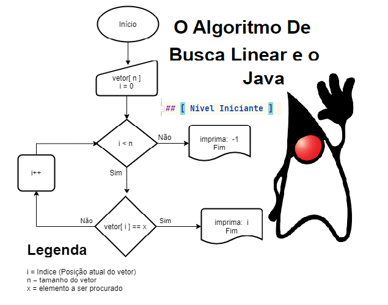

# O Algoritmo De Busca Linear e o Java

Neste artigo vou falar sobre o algoritmo de Busca linear e a evolução do Java na sua execução. O algoritmo de Busca Linear é um algoritmo simples, que faz a pesquisa por um elemento em um vetor (array ou lista) desordenado, de modo sequencial.

Visão do acesso sequencial do vetor


Os elementos de um vetor são identificados por meio de índices. (índice = posição no vetor)

Visão índices e elementos do vetor

O primeiro elemento tem o índice 0 (zero). Portanto, para um vetor de n elementos, os índices variam de 0 a n-1., acima vemos um vetor numérico de 11 elementos, mas poderia ser qualquer outro tipo de dado como letras, símbolos e etc..

# Algoritmo de Busca Linear
<b>Passos:</b>

“dado um vetor de números (inteiros) desordenado”

“dado um número a ser buscado no vetor”

“para cada posição do vetor”

“comparar se, o elemento na posição atual do vetor, é igual ao número buscado”

“se, o número na posição do vetor for igual ao número buscado”

“o algoritmo termina e imprime o índice do número encontrado”

“caso contrario, a cada loop, a busca continua para a próxima posição do array”

“se todo array foi percorrido e o número não encontrado, imprima  -1”


# Em Portugol:
<b>Entrada:</b>

Vetor de números (inteiros) desordenado.
Um número a ser buscado.

<b>Saída:</b>

Se encontrou o número no vetor imprima o índice do número.
Se não encontrou o número imprima -1.


# Fluxograma do algoritmo


# Primeira abordagem
### Usando a Força Bruta
Típico do algoritmo de Busca Linear a busca por força bruta é de fácil implementação. Entretanto, seu custo tende a crescer muito rápido, caso a pesquisa seja feita em um vetor  muito grande. Em Java esse código é bastante simples, sendo utilizado um “for”  para interação no vetor e um “if” para verificação do valor procurado. Veja o código abaixo:

```java
public static int buscaLinear(int[] vetor, int numeroProcurado) {

    int n= vetor.length; /* obtendo o tamanho do vetor*/

    for (int i = 0; i < n; i++)
        if (vetor[i] == numeroProcurado)
            return i;

    return –1; // Não achou número procurado, retorna -1
}
```
Sendo esse algoritmo quanto a sua complexidade, um algoritmo O(n).

O(1) – melhor caso: o elemento buscado é o primeiro do array

O(N) – pior caso: o elemento buscado é o último do array ou não existe no array

O(N/2) – caso médio: o elemento é encontrado após (N+1)/2 comparações.


# Segunda abordagem
### Usando Hash Map

Usando um Hash Map  em Java podemos melhorar a complexidade de tempo de execução, de uma maneira mais eficiente para verificar se um número existe em um array.

Pois se o número existe, precisamos retornar seu índice e em Java a melhor maneira de manter um mapeamento de cada elemento do vetor para seu índice é utilizando um Hash Map onde o que  importa agora e o valor da sua chave para encontrar o número buscado,  e a chave  pode ser:  string, int, double,  Object  etc… no nosso caso será um número.

O Hash Map esta presente no Java desde  a versão 1.2, e  tem recebido melhorias  significativas de performance e sintaxe a cada nova versão do Java,  é notório o uso massivo desse recurso em códigos Java.

O HashMap é uma implementação da interface Map e de forma simples de dizer, é que um conjunto de pares chave-valor  (key, value) que tem o poder de se auto redimensionar dentre outras características importantes, que devem ser usadas com cautela.


Você pode aprender mais sobre HashMap lendo o artigo do [RamsKrishna Joshi](https://www.slideshare.net/RamakrishnaJoshi1/how-hashmap-works-internally-in-java)  ou do [Nashim Salmay](https://laptrinhx.com/do-you-know-how-map-hashmap-works-internally-in-java-part-1-257465544/) e consultando as referências no final desse artigo. Com uso do HashMap  reduzimos o tempo de pesquisa de O(n) para O(1)  trocando espaço por velocidade.

Uma tabela Hash é construída exatamente para esse propósito, de suportar pesquisas rápidas em um tempo quase constante.

Uma implementação simples do algoritmo usando Hash Map usa uma interação “for“, onde adicionamos o valor de cada elemento e seu índice à tabela (Map) e só então verificamos com um “if” se o número existe na tabela.
```java
 public static int buscaLinearComHashMapTwoPass(int[] vetor, int numeroProcurado) {
    Map<Integer, Integer> map = new HashMap<>();
    
    // passsando os dados do vetor pra um HasMap, o elemento do vetor sera a chave
    for (int i = 0; i < vetor.length; i++) {
        map.put(vetor[i], i);
    }
    
    // verificando se o número procurado (a chave) existe no hashMap
    if (map.containsKey(numeroProcurado))
        return map.get(numeroProcurado);
    
    // se nao encontrado
    return –1;
}
```

# Terceira abordagem
### Hash Map  com uma iteração verificada

Acontece que podemos fazer isso em uma única iteração “for“. Enquanto iteramos inserimos e os elementos do vetor na tabela, também olhamos para verificar com um “if” se o número procurado já existe na tabela. Se existir, o retornamos imediatamente.

```java
public static int buscaLinearComHashMapOnePass(int[] vetor, int numeroProcurado) {

    Map<Integer, Integer> map = new HashMap<>();
    
    for (int i = 0; i < vetor.length; i++) {
        // verifica se o numeroProcurado ja existe no HashMap
        if (map.containsKey(numeroProcurado))
            return map.get(numeroProcurado);
        
        map.put(vetor[i], i); // passsando os dados do vetor pra um HasMap
    }
    
    // se nao encontrado
    return -1;
}
```
# Quarta abordagem
### Utilizando Stream API

Streams API é um recurso que o Java traz  a partir da versão 8, com novas classes e métodos que ajudam a manipular coleções (vetor, array, listas) de maneira mais simples e eficiente, usando o estilo de programação funcional.  Que muda a forma como se escreve o código. Abaixo o algoritmo de Busca Linear escrito em Java usando a sintaxe das linguagens que seguem o paradigma funcional. IntStream é uma interface dessa API e tem suporte a operações de agregação sequenciais e paralelas, para encontrar um número dentro do vetor (array ou lista). Veja código abaixo:


```java
 private static int buscaLinearStream(int[] vetor, int numeroProcurado) {
    return IntStream.range(0, vetor.length)
        .filter(i -> vetor[i] == numeroProcurado)
        .mapToObj(index -> index)
        .findFirst()
        .orElse(-1); // se nao encontrou retorna -1
 }
```

## Coleções como fontes de dados para Streams

Todas as coleções no Java podem ser fontes de dados para a Stream API

## Manipulando numeros

```java
int vetor[] = {1, 5, 9, 4, 8, 50, 30, 40, 78, 63, 47};
```

Convertendo vetor(array ou lista) para Streams

```java
Stream stream1 = Stream.of(vetor)  ou Stream stream1 = Arrays.stream(array)
```

## Manipulando textos

Inclusive textos e frase podem ser facilmente manipuladas com Stream,  transformndo  uma string em uma Lista de String ou uma String em uma Lista de caracter, que como beneficio passam a herdar todos os métodos da interface List, tais como insert, search, remove, Iterator etc…Veja o código abaixo:


```java
// Convertendo uma string em uma Lista de strings
//   entrada: Udinei da Silva
//   saida: [Udinei, da, silva]

 public static List<String> split(String str){
    return Stream.of(str.split(" "))
    .map(elem -> new String(elem))
    .collect(Collectors.toList());
 }
```
```java
// Convertendo uma string em uma Lista de strings
// entrada: Udinei da Silva
// saida: [Udinei, da, silva]

 public static List<String> split(String str){
    return Stream.of(str.split(” “))
       .map(elem -> new String(elem))
       .collect(Collectors.toList());
 }
```

# Conclusão
O algoritmo de Busca Linear é considerado um algoritmo simples e básico no mundo da programação, mas muito utilizado no dia a dia do desenvolvedor, e saber empregar diversas abordagens técnicas para resolver problemas com esse algoritmo é de suma importância.

Como podemos ver esse algoritmo pode ser abordado de diversas formas, e nesse artigo vimos que o Java traz consigo uma evolução na  melhor forma de executar esse algoritmo, evoluindo desde as estruturas básicas de controles para estruturas de dados mais eficientes como HashMap, sendo a terceira abordagem aqui apresentada a mais eficiente, seguida do uso da  Streams API.

A Stream API eleva o Java para outro nível de codificação, pois diminui a quantidade de código a ser escrito e absorve responsabilidades de controle de  fluxos como while, for, do while etc, ficando somente as regras de negócio  a única responsabilidade do desenvolvedor.

A evolução do Java com uso de Streams  fornece técnicas sofisticadas de processamento de dados, e uma  nova forma de escrever códigos  Java, sinalizando uma forte tendência em Java, fazer uso dessa API para solucionar de forma simples e objetiva algoritmos como o de Busca Linear e outros algoritmos de grande complexidade tornando-os mais eficientes em gerenciamento de memória heap e trabalhos de execução paralela.

Esse artigo é uma versão inspirada na solução do problema <b>TowSum</b> proposto pela LeetCode em seu [site](https://leetcode.com/problems/two-sum/solution/). A Leetcode é uma plataforma que ajuda você a aprimorar suas habilidades em programação. Vale a pena se cadastrar no site, tem muito conteúdo de valor lá e muita coisa grátis sobre programação. 


Você pode conferir o código do artigo no meu [gitHub](https://github.com/Udinei/o-algoritmo-de-busca-linear-e-o-Java-artigo) ou ler o artigo no meu blog [dicasna.com](https://dicasna.com/tecnologia/) (em construção)


Dúvidas ou sugestões, manda no meu email: udineisilva@gmail.com


# Referências
- [Algoritmos Teoria e Prática](https://www.cin.ufpe.br/~ara/algoritmos-%20portugu%EAs-%20cormen.pdf)
- [HashMap](https://docs.oracle.com/javase/8/docs/api/java/util/HashMap.html)
- [Busca por Força Bruta](https://pt.wikipedia.org/wiki/Busca_por_for%C3%A7a_bruta)
- [Argumentação Big-O](https://qastack.com.br/programming/3255/big-o-how-do-you-calculate-approximate-it)  
- [Streams API](https://www.oracle.com/br/technical-resources/articles/java-stream-api.html)
- [InstStream](https://docs.oracle.com/javase/8/docs/api/java/util/stream/IntStream.html)